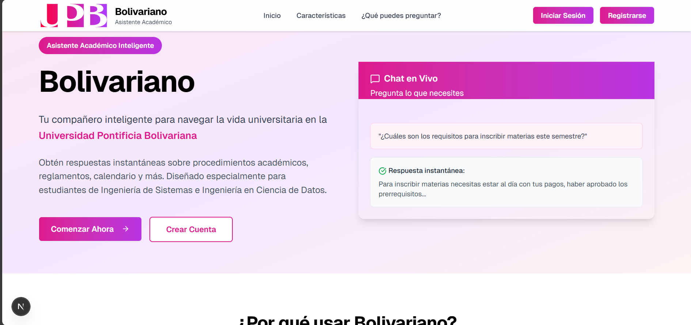
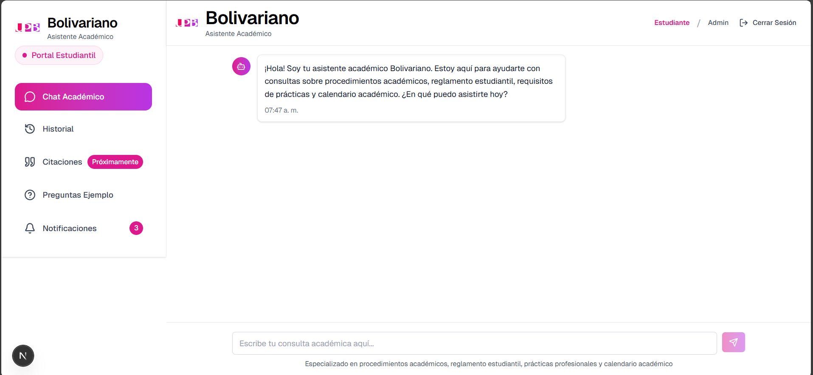

# Bolivariano: Asistente Académico Inteligente

Puedes visualizar la aplicación desplegada en [https://bolivariano.vercel.app/](https://bolivariano.vercel.app/)

## Home de Bolivariano


## Vista Previa del Chatbot


## Desarrolladores.
1. Thomas Camilo Vanegas Acevedo

## Herramientas Usadas
1. Frontend: NextJS (ReactJS + TypeScript + Tailwind) => Tener instalado NodeJS, React, Next ...
2. Backend: Python (FastAPI + NeonDB (PostgreSQL) + Cloudflare R2) => Tener instalado Python y PIP.

## Ejecución Local del Proyecto
1. Ejecucion del servidor backend
```bash
cd backend/
pip install -r requirements.txt
python uvicorn main:app --reload
```

2. Ejecucion del servidor next (en otra CLI)
```bash
npm run dev
```
3. El frontend se visualiza en: [http://localhost:3000](http://localhost:3000)

4. El funcionamiento del API se visualiza en: [http://localhost:8000/docs](http://localhost:8000/docs)